<h1 align = "center">ccmall跨平台移动商城 [uniapp端]</h1>

<p align="center">
  
  
  
</p>

####  :cat: 项目介绍
ccmall是一个基于uniapp、springcloud alibaba的跨平台移动商城，致力于帮助企业及个人开发者快速交付，支持微信小程序 + H5 + 公众号 + APP，完美支持二次开发，让您快速搭建个性化独立商城。

    如果对您有帮助，您可以点右上角 “Star” 收藏一下 ，获取第一时间更新，谢谢！

####  :dog: 源码下载
1. 移动端（客户端，基于uniapp开发 用于生成H5、微信小程序、APP）

    仓库 | 地址
    ---|---
    码云  | [https://gitee.com/sjtucc/ccmall-uniapp](https://gitee.com/sjtucc/ccmall-uniapp)
    github     | [https://gitee.com/sjtucc/ccmall-uniapp](https://gitee.com/sjtucc/ccmall-uniapp)
    
2. 管理端（前端，基于vue开发 用于系统管理员操作资源权限）

    地址：[https://gitee.com/sjtucc/ccmall-uniapp/tree/master/ccmall-vue](https://gitee.com/sjtucc/ccmall-uniapp/tree/master/ccmall-vue)

3. 服务端（**ccmall-cloud**后端，基于最新springcloud alibaba开发 完备的微服务脚手架与商城业务结合项目）
   
    地址：[https://gitee.com/sjtucc/ccmall-cloud](https://gitee.com/sjtucc/ccmall-cloud)   
    
    注：ccmall-cloud由团队持续更新，只需99元即可获得ccmall-cloud最新的源码、安装文档、安装技术支持，需要请联系团队微信：**chensir_666888**      
  <div align="center">  
    
  </div>
    
####  :mouse: 移动端-部分截图（点击可大图预览）
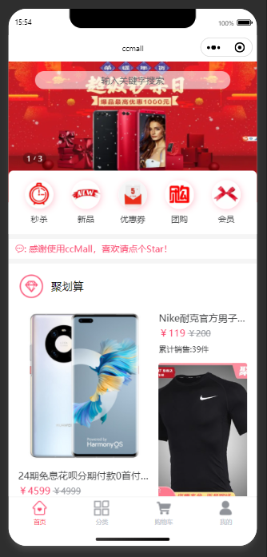


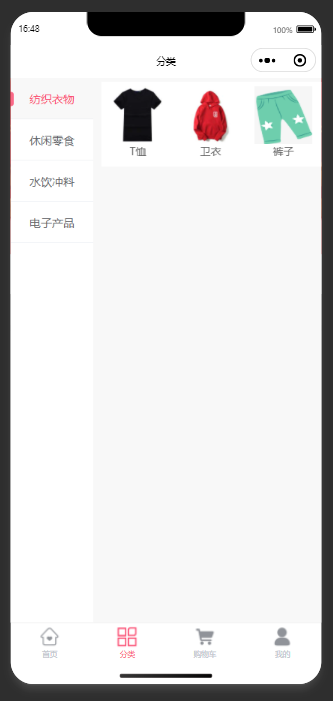

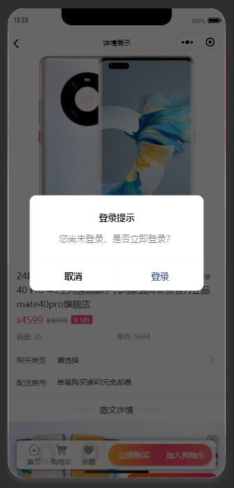

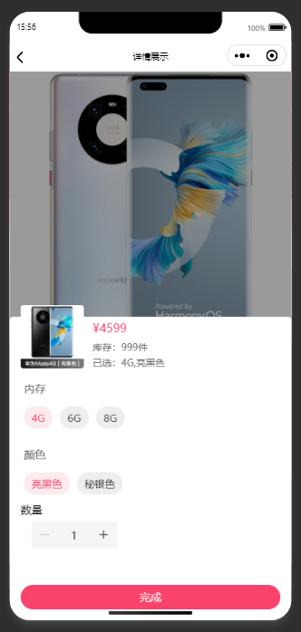
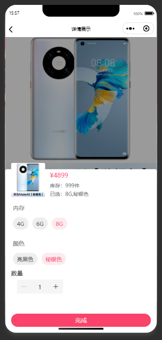


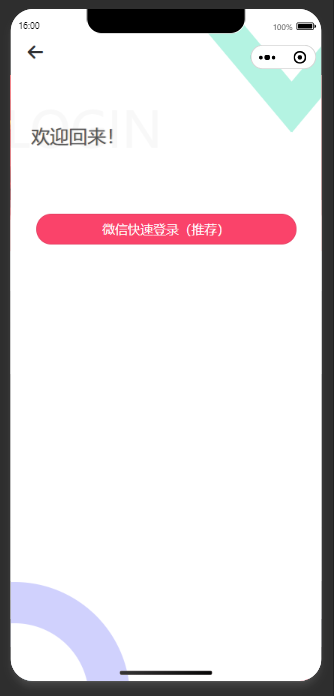
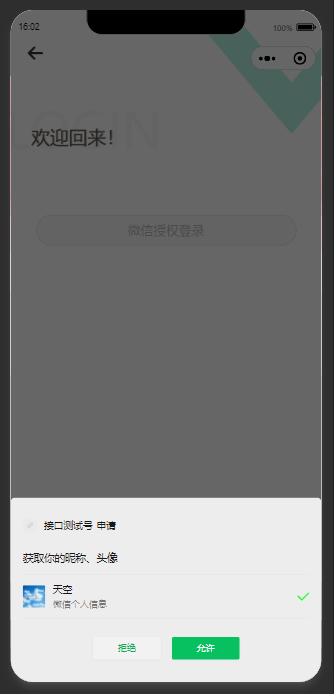

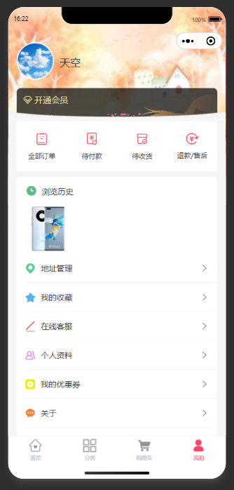
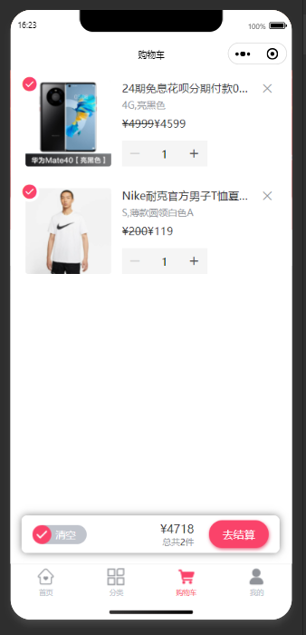
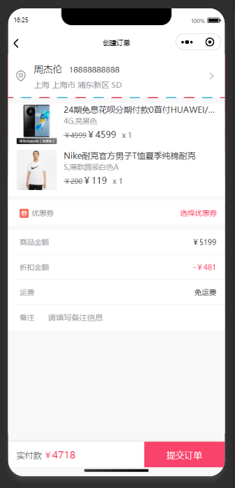
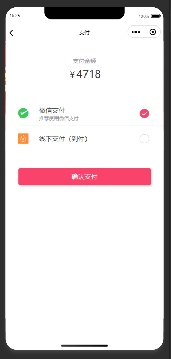

####  :hamster: 管理端-部分截图（点击可大图预览）
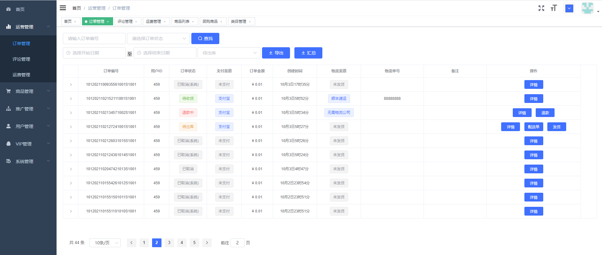
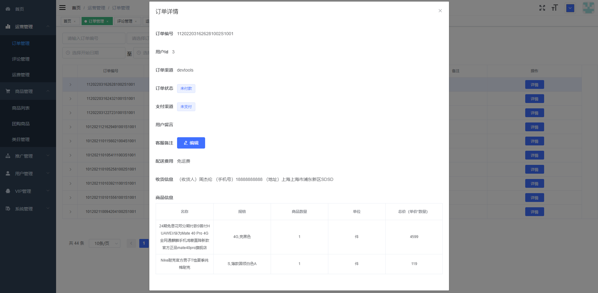


####  :whale: ccmall-cloud技术架构（点击可大图预览） 
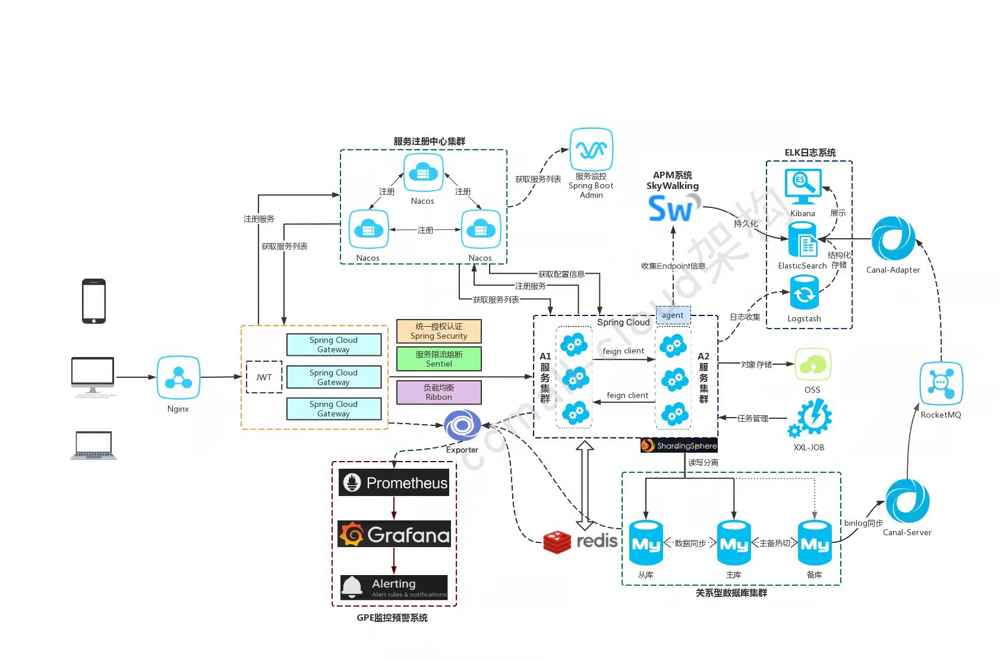

####  :tropical_fish: ccmall-cloud技术特性
- 技术框架：基于最新的`Spring Cloud`, `Spring Boot`, `Spring Cloud Alibaba`版本进行架构设计，持续集成更新；

- 服务注册：以`Nacos`作为注册中心，实现多配置、分群组、分命名空间、多业务模块的服务注册与发现；

- 动态配置：以`Nacos`作为配置中心，实现多配置、分群组、分命名空间、多业务模块的实时配置与感知；

- 统一认证：基于`Oauth2`认证协议，采用jwt的方式，实现多中心统一认证，通过自定义复杂校验逻辑，实现微信、支付宝等多种登录模式；

- 全局监控：采用`SkyWalking`实现链路追踪、指标观测、性能监测、扩容预判；

- 远程调用：封装`Feign`实现远程调用，原生集成Spring Clound技术体系；

- 业务熔断：采用`Sentinel`实现业务熔断处理，实时生效，安全可控，避免业务系统雪崩；

- 服务网关：基于`Spring Cloud Gateway`实现统一服务入口、授权认证、请求日志记录、黑白名单控制；

- 在线文档：通过接入`Knife4j`，实现多业务模块聚合在线API文档的查看与调试；

- 代码生成：基于`Mybatis-plus-generator`逆向工程自动生成代码，提升开发效率；

- 消息中心：封装消息中间件`RocketMQ`、`Kafka`和`Kafka`，对业务进行异步处理、事务补偿、以及日志收集;

- 前后分离：微服务与前端页面逻辑完全分离，前端采用`vue-element-admin`。
  

####  :panda_face: ccmall-cloud目录结构
```lua
ccmall-cloud -- 父项目，公共依赖
│  ├─ccmall-business -- 核心业务模块
│  ├─ccmall-data -- 业务数据模块
│  ├─ccmall-launcher -- 业务发布模块
│  ├─ccmall-admin -- 后台管理接口模块
│  ├─ccmall-app -- 移动商城接口模块
│  ├─ccmall-support -- 通用支持模块
│  ├─ccmall-doc -- 项目文档
│  ├─ccmall-core-starter -- 微服务脚手架
│  │  ├─ccmall-job -- 任务调度
│  │  ├─ccmall-feign -- 远程调用
│  │  ├─ccmall-cloud -- 微服务封装
│  │  ├─ccmall-database -- 数据库
│  │  ├─ccmall-encrypt -- 加密算法
│  │  ├─ccmall-file -- 文件管理
│  │  ├─ccmall-kafka -- 消息队列
│  │  ├─ccmall-rocket -- 消息队列
│  │  ├─ccmall-rabbit -- 消息队列
│  │  ├─ccmall-log -- 日志封装
│  │  ├─ccmall-redis -- 缓存
│  │  ├─ccmall-sms -- 短信
│  │  ├─ccmall-oss -- 对象存储
│  │  ├─ccmall-lock -- 分布式锁
        
...不一一列举
```

####  :rabbit: 如何使用移动端

##### 一、导入uniapp项目

    1. 首先下载HBuilderX并安装，地址：https://www.dcloud.io/hbuilderx.html
    2. 打开HBuilderX -> 顶部菜单栏 -> 文件 -> 导入 -> 从本地目录导入 -> 选择uniapp端项目目录
    3. 找到config.js文件，找到里面的apiUrl项，填入已搭建的后端url地址
    4. 打开manifest.json文件，选择微信小程序配置，填写小程序的appid

##### 二、本地调试

    1. 打开HBuilderX -> 顶部菜单栏 -> 运行 -> 运行到浏览器 -> Chrome
    2. 如果请求后端api时 提示跨域错误，可安装Chrome插件：【Allow CORS: Access-Control-Allow-Origin】，地址：https://chrome.google.com/webstore/detail/allow-cors-access-control/lhobafahddgcelffkeicbaginigeejlf

##### 三、打包发行（H5）

    1. 打开HBuilderX -> 顶部菜单栏 -> 发行 -> 网站H5-手机版
    2. 打包后的文件路径：/unpackage/dist/build/h5
    3. 将打包完成的所有文件 复制到商城后端/pulic目录下，全部替换

##### 四、打包发行（微信小程序）

    1. 下载微信开发者工具并安装，地址：https://developers.weixin.qq.com/miniprogram/dev/devtools/download.html
    2. 打开HBuilderX -> 顶部菜单栏 -> 发行 -> 小程序-微信
    3. 打包后的文件路径：/unpackage/dist/build/mp-weixin
    5. 打开微信开发者工具 导入 打包完成的项目
    6. 检查没有运行错误，在右上方上传小程序

##### 五、打包发行（Android、IOS）

    1. 下载微信开发者工具并安装，地址：https://developers.weixin.qq.com/miniprogram/dev/devtools/download.html
    2. 打开HBuilderX -> 顶部菜单栏 -> 发行 -> 原生App-云打包
    3. 填写相关信息（app图标，启动页等详细配置可在 manifest.json 进行配置）


####  :wolf: 版权须知

1. 允许个人学习研究使用，支持二次开发，允许商业用途（仅限自运营）。
2. 允许商业用途，但仅限自运营，如果商用必须保留版权信息，望自觉遵守。
3. 不允许对程序代码以任何形式任何目的的再发行或出售，否则将追究侵权者法律责任。


